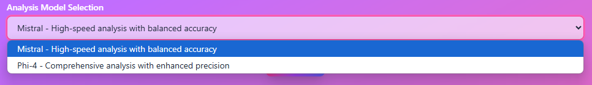
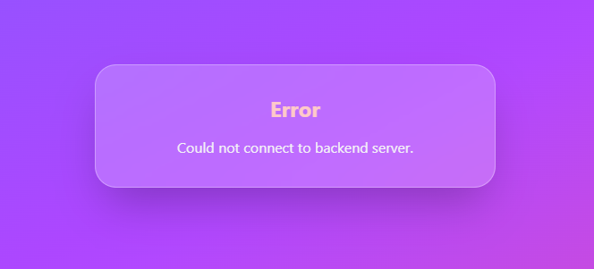

# Bio-data Analysis System

An intelligent document analysis system that automates the screening and matching of employee bio-data against specific criteria using Retrieval-Augmented Generation (RAG) and Large Language Models (LLM).

## Prerequisites

Before you begin, ensure you have the following installed:
- Python 3.8 or higher
- Node.js 16 or higher
- Git
- Ollama (for LLM models)

### Setting up Ollama

1. Visit [Ollama's official website](https://ollama.ai/download)
2. Download and install Ollama for your operating system
3. Start Ollama service
4. Pull required models:

```bash
# Pull Mistral model
ollama pull mistral

# Pull Phi-4 model
ollama pull phi4
```

## Windows Application Installation

You can install the Windows application directly from the Given Drive Link:

1. [Download link](https://drive.google.com/file/d/1Y5WkW1g9O2y5qBEdTAj-fFq9CC8fjDl4/view?usp=sharing)
2. After Download Double-click the installer to begin the installation process
3. Follow the installation wizard instructions

**Important Note:** Before using the application, make sure you have:
- Ollama installed on your system
- Required models pulled in Ollama (Mistral and Phi-4)
- Ollama service running in the background

To verify Ollama setup:

```bash
# Check if Ollama is running
ollama list
```


```bash
# If models are missing, pull them
ollama pull mistral
ollama pull phi4
```

## Manual Installation Steps

### 1. Clone the Repository

```bash
git clone https://github.com/utsav1072/Retrieval-Augmented-Generation-RAG-?tab=readme-ov-file
cd <project_folder>
```

### 2. Backend Setup

1. Create and activate a virtual environment:

```bash
# Windows
python -m venv venv
.\venv\Scripts\activate

# Linux/Mac
python3 -m venv venv
source venv/bin/activate
```

2. Install Python dependencies:

```bash
cd backend
pip install -r requirements.txt
```

3. Run database migrations:

```bash
python manage.py migrate
```

### 3. Frontend Setup

1. Install Node.js dependencies:

```bash
cd bio-data-analysis-fe
npm install
```

2. Install Desktop App dependencies:

```bash
cd desktop-app
npm install
```

### 4. Starting the Application

#### Quick Start (Windows)

After completing all setup steps, you can use the provided batch file to start the frontend and desktop app:

```bash
# Double click start-app.bat or run from terminal
.\start-app.bat
```

**Note:** Make sure the backend server and Ollama are running before using the application.

#### Manual Start

1. Ensure Ollama is running with the required models
2. Ensure the backend server is running (http://localhost:8000/)
3. Start the frontend web application (http://localhost:5173/):

```bash
cd bio-data-analysis-fe
npm run dev
```

4. Start the desktop app:

```bash
cd desktop-app
npm run dev
```

## Usage Guide

### 1. Using the Application

1. **Set Search Criteria**
   - Fill in the relevant fields in the form:
     - Name
     - Staff Number
     - Education
     - Designation
     - Present Grade
     - Category
     - PWD Status
     - And other relevant fields
   - Or use the custom prompt field for specific requirements

   

2. **Select Model**
   - Choose between:
     - Mistral: Faster processing, good for quick screening
     - Phi-4: More accurate, better for detailed analysis

   

3. **Upload Bio-data**
   - Click the submit button to select PDF files
   - Supported format: PDF only
   - Maximum file size: 1MB per file

   

4. **Process Documents**
   - Click "Analyze Documents" to start processing
   - Wait for the analysis to complete
   - View and download matching documents

### 2. Understanding Results

- Matching documents will be displayed in a list
- Each document can be:
  - Downloaded individually
  - Downloaded as part of a ZIP archive
  - Viewed in the browser


## Project Structure

```
BHEL/
├── backend/
│   ├── api/
│   │   ├── views.py      # Main processing logic
│   │   └── urls.py       # API endpoints
│   └── manage.py
├── bio-data-analysis-fe/
│   ├── src/
│   │   ├── components/   # UI components
│   │   ├── context/      # React context
│   │   └── App.jsx       # Main application
│   └── package.json
├── desktop-app/          # Electron desktop application
└── README.md
```

## TechStack

### Backend (Django)
- Django REST Framework for API endpoints
- LangChain for document processing
- Ollama integration for LLM models
- Parallel processing for multiple documents

### Frontend (React)
- React with Vite for fast development
- TailwindCSS for styling
- Framer Motion for animations
- Modern UI components

### Desktop App (Electron)
- Cross-platform desktop application
- Integrated with the web frontend
- Native system integration

## Troubleshooting

### Common Issues

1. **Ollama Connection Error**
   - Ensure Ollama service is running
   - Check if models are properly pulled

2. **File Upload Issues**

   
   - Check file size (max 1MB)
   - Ensure PDF format
   - Verify file permissions

3. **Processing Errors**
   - Check backend logs
   - Verify model availability
   - Ensure sufficient system resources

4. **Application Start Issues**

   
   - Restart the application
   - Verify Ollama is running
   - In case of Manual Installation:
     - Ensure backend server is running 
     - Check if all dependencies are installed 
     - Ensure virtual environment is activated
